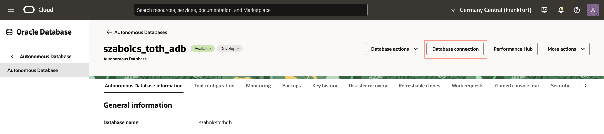
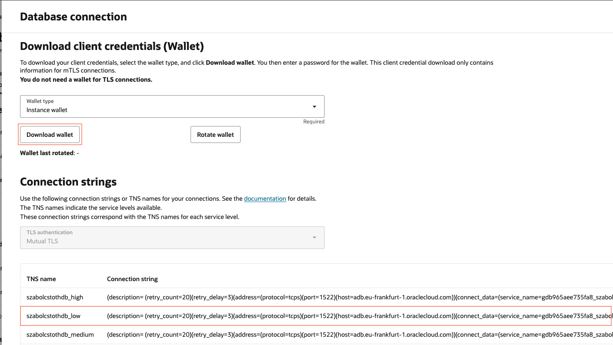

# Example Code

Examples to demonstrate [Hummingbird 2.0](https://hummingbird.codes) with [OracleNIO](https://github.com/lovetodream/oracle-nio/tree/main).

## Preparation
### Step 1. Local Database

Create an `.env.` file with the credentials:
```
DATABASE_HOST=127.0.0.1
DATABASE_SERVICE_NAME=freepdb1
DATABASE_USERNAME=new_user
DATABASE_PASSWORD=TOPs3cr3tPassw0rd
```
If you are not sure how to create a new user, password and tablespace, you can find detailed instructions [here](https://medium.com/@kicsipixel/how-to-start-using-oracle-database-23ai-free-container-image-15eb13ec344f).

### Step 2. Remote Database (ADB)
Download wallet for mTLS connection, and copy the Connection string from OCI console.


Create an `.env.` file with the credentials:
```
REMOTE_DATABASE_HOST=adb.eu-frankfurt-1.oraclecloud.com
REMOTE_DATABASE_PORT=1522
REMOTE_DATABASE_SERVICE_NAME=gdb965aee735fa8_szabolcstothdb_low.adb.oraclecloud.com
REMOTE_DATABASE_USERNAME=ADMIN
REMOTE_DATABASE_PASSWORD=T0pS3cr3t
# Wallet folder should be in /Sources/App/Credentials unzipped
REMOTE_DATABASE_WALLET_PASSWORD=myWall3tPassw0rd
```

## Examples
- [simple-crud](https://github.com/kicsipixel/oracle-nio-examples/tree/main/simple_crud) - Simple application to demonstrate CRUD operations
- [spatial](https://github.com/kicsipixel/oracle-nio-examples/tree/main/spatial) - Example to use SDO_GEOMETRY for location analysis
- [spatial-web](https://github.com/kicsipixel/oracle-nio-examples/tree/main/spatial-web) - Example to use SDO_GEOMETRY for location analysis, showing result on map using [MapKit JS](https://developer.apple.com/maps/web/)
- [json](https://github.com/kicsipixel/oracle-nio-examples/tree/main/json) - Example to use JSON natively with JSON data type with ADB in OCI
- [openapi](https://github.com/kicsipixel/oracle-nio-examples/tree/main/openapi) - Example to use Swift OpenAPI Generator with OracleNIO and ADB in OCI
