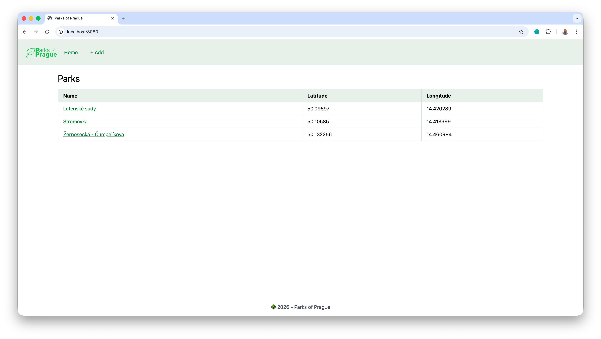

# Elementary Swift

Hummingbird server framework with Elementary HTML templating and Tailwind CSS integration using SwiftKaze.

## Dependencies

- [Elementary](https://github.com/elementary-swift/elementary) - Type-safe HTML templating in Swift
- [Hummingbird Elementary](https://github.com/hummingbird-community/hummingbird-elementary) - Elementary integration for Hummingbird
- [Oracle NIO](https://github.com/lovetodream/oracle-nio) - Oracle database driver for Swift
- [Swift Configuration](https://github.com/apple/swift-configuration) - Configuration management
- [SwiftKaze](https://github.com/kicsipixel/SwiftKaze) - Tailwind CSS integration for Swift

## Pages

- `/` - Home page listing all parks
- `/parks/create` - Form to add a new park
- `/parks/:id` - View park details
- `/parks/:id/edit` - Edit an existing park
- `/parks/:id/delete` - Remove a park
