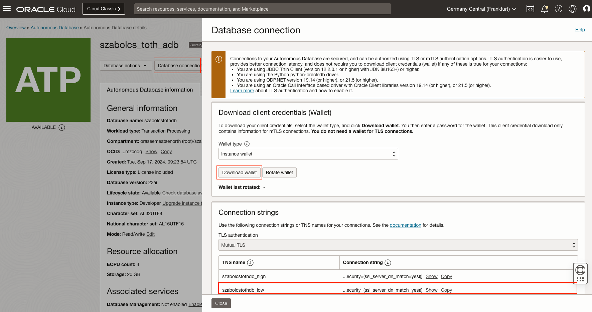
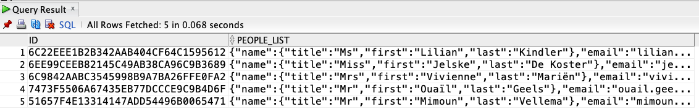

# Example to use JSON natively with JSON data type with ADB in OCI

This example demonstrates how to natively write, read, and query JSON data using Oracle Database 23ai as an [Autonomous Database](https://www.oracle.com/autonomous-database/) in Oracle Cloud Infrastructure (OCI).

The sample data (included in the repo) :
```json
{
  "results": [
    {
      "name": {
        "title": "Ms",
        "first": "Lilian",
        "last": "Kindler"
      },
      "email": "lilian.kindler@example.com",
      "nat": "DE",
      "hobbies": ["karate", "running", "movies"]
    },
    {
      "name": {
        "title": "Mr",
        "first": "Thoralf",
        "last": "Strecker"
      },
      "email": "thoralf.strecker@example.com",
      "nat": "DE",
      "hobbies": ["reading"]
    },
    ...
  ]
}
```
## Preparation
### Step 1.
Download wallet for mTLS connection, and copy the `Connection string`.


### Step 2.
Create a .env file and add the credentials:
```
DATABASE_HOST=adb.eu-frankfurt-1.oraclecloud.com
DATABASE_PORT=1522
DATABASE_SERVICE_NAME=gdb965aee735fa8_szabolcstothdb_low.adb.oraclecloud.com
DATABASE_USERNAME=ADMIN
DATABASE_PASSWORD=
# Wallet folder should be in /Sources/App/Resources foler unzipped
DATABASE_WALLET_PASSWORD=
```

### Step 3.

To make it easier, you can seed the database with some data from a `.json` file. 
Simply run the application for the first time only with:
```
swift run App --seed
```

Oracle Database [supports JSON natively](https://docs.oracle.com/en/database/oracle/oracle-database/21/adjsn/json-in-oracle-database.html#GUID-A8A58B49-13A5-4F42-8EA0-508951DAE0BB) with relational database features, including transactions, indexing, declarative querying, and views. Unlike relational data, JSON data can be stored in the database, indexed, and queried without any need for a schema that defines the data.

Data stored in database:


## Routes are as follows

- __GET__: /health - Checks server health status
- __GET__: /api/v1/people- Lists all the people in the database
- __GET__: /api/v1/people/:id - Show a single person with id
- __POST__: /api/v1/people/filter - Returns the list of people which comply to the filter

### 🩺 Health
Simple endpoint to check whether the server is alive, giving back `200 OK`

- __URL:__ http://localhost:8080/health
- __HTTPMethod:__ `GET`

```
curl -i http://localhost:8080/health
HTTP/1.1 200 OK
Content-Length: 0
Date: Thu, 12 Sep 2024 12:22:32 GMT
Server: spatial
```

### {  } JSON API
#### Lists all the people in the database

- __URL:__ http://localhost:8080/api/v1/people
- __HTTPMethod:__ `GET`

```
curl "http://localhost:8080/api/v1/people"
```

__Return value:__
An array of
- `id`:  person UUID
- `nat`: nationality
- `email`: email address
- `hobbies`: array of hobbies
- `name` 
    - `title`: title
    - `first`: first name
    - `last`: last name

```json
[
  {
    "id": "6C22EEE1-B2B3-42AA-B404-CF64C1595612",
    "nat": "DE",
    "email": "lilian.kindler@example.com",
    "hobbies": [
      "karate",
      "running",
      "movies"
    ],
    "name": {
      "first": "Lilian",
      "title": "Ms",
      "last": "Kindler"
    }
  },
  {
    "id": "FC2BF354-A721-4471-9F77-5E195896BCF1",
    "name": {
      "last": "Strecker",
      "title": "Mr",
      "first": "Thoralf"
    },
    "hobbies": [
      "reading"
    ],
    "nat": "DE",
    "email": "thoralf.strecker@example.com"
  },
  ...
]
```

#### Show a single person with id

- __URL:__ http://localhost:8080/api/v1/people/:id
- __HTTPMethod:__ `GET`

```
curl "http://localhost:8080/api/v1/people/6C22EEE1-B2B3-42AA-B404-CF64C1595612"
```

__Return value:__
- `id`:  person UUID
- `nat`: nationality
- `email`: email address
- `hobbies`: array of hobbies
- `name` 
    - `title`: title
    - `first`: first name
    - `last`: last name

```json
{
  "email": "lilian.kindler@example.com",
  "name": {
    "first": "Lilian",
    "last": "Kindler",
    "title": "Ms"
  },
  "nat": "DE",
  "id": "6C22EEE1-B2B3-42AA-B404-CF64C1595612",
  "hobbies": [
    "karate",
    "running",
    "movies"
  ]
}
```

#### Returns the list of people which comply to the filter

- __URL:__ http://localhost:8080/api/v1/people/filter
- __HTTPMethod:__ `POST`

```
curl -X "POST" "http://localhost:8080/api/v1/people/filter" \
     -H 'Content-Type: application/json' \
     -d $'{
  "query": [
    {
      "operator": "AND",
      "conditions": [
        {
          "key": "hobbies",
          "value": "running"
        },
        {
          "key": "nat",
          "value": "NL"
        },
        {
          "key": "hobbies",
          "value": "movies"
        }
      ]
    }
  ]
}'
```
This will generate the following PL/SQL query:
```sql
SELECT
    *
FROM
    people
WHERE
    JSON_EXISTS ( people_list, '$.hobbies[*]?(@ == "running")' )
    AND JSON_VALUE(people_list, '$.nat') = 'NL'
    AND JSON_EXISTS ( people_list, '$.hobbies[*]?(@ == "movies")' );
```

__Return value:__
An array of
- `id`:  person UUID
- `nat`: nationality
- `email`: email address
- `hobbies`: array of hobbies
- `name` 
    - `title`: title
    - `first`: first name
    - `last`: last name

```json
[
  {
    "hobbies": [
      "running",
      "movies"
    ],
    "nat": "NL",
    "id": "6C9842AA-BC35-4599-8B9A-7BA26FFE0FA2",
    "name": {
      "first": "Vivienne",
      "title": "Mrs",
      "last": "Mariën"
    },
    "email": "vivienne.marien@example.com"
  },
  {
    "id": "7473F550-6A67-435E-B77D-CCCE9C9B4D6F",
    "email": "ouail.geels@example.com",
    "nat": "NL",
    "hobbies": [
      "running",
      "movies"
    ],
    "name": {
      "last": "Geels",
      "title": "Mr",
      "first": "Ouaïl"
    }
  },
  {
    "id": "51657F4E-1331-4147-ADD5-4496B0065471",
    "nat": "NL",
    "email": "mimoun.vellema@example.com",
    "name": {
      "title": "Mr",
      "first": "Mimoun",
      "last": "Vellema"
    },
    "hobbies": [
      "running",
      "movies"
    ]
  }
]
```
